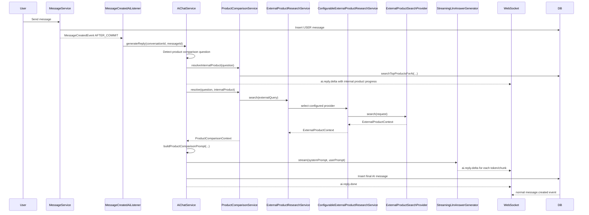

# AI Product Comparison Flow

Tai lieu nay mo ta flow xu ly khi user hoi AI ve viec so sanh san pham cua shop voi san pham ben ngoai internet, dong thoi mo ta kien truc provider de sau nay co the thay Google CSE bang Brave, Tavily, mock, hoac provider khac.

## Muc Tieu Nghiep Vu

Khi user hoi mot cau kieu:

> So sanh san pham A cua shop voi san pham B tren internet

He thong khong de LLM tu doan du lieu san pham ben ngoai. Backend se:

1. Nhan dien day la cau hoi so sanh san pham.
2. Tim san pham noi bo trong catalog cua shop.
3. Lay du lieu san pham ben ngoai thong qua provider search duoc cau hinh.
4. Build prompt gom hai khoi du lieu ro rang:
   - `OWN_PRODUCT_CONTEXT`
   - `EXTERNAL_PRODUCT_CONTEXT`
5. Stream cau tra loi tung phan ve frontend.
6. Luu final assistant message vao bang `messages`.

## Runtime Flow



## Provider Architecture

High-level dependency direction:

```text
ProductComparisonService
    -> ExternalProductResearchService
        -> ConfigurableExternalProductResearchService
            -> ExternalProductSearchProvider
                -> GoogleCustomSearchExternalProductSearchProvider
                -> BraveSearchExternalProductSearchProvider
                -> TavilyExternalProductSearchProvider
                -> MockExternalProductSearchProvider
                -> NoOpExternalProductSearchProvider
```

Important rule: `ProductComparisonService` must not know about Google, Brave, Tavily, or any concrete web search API. It only depends on `ExternalProductResearchService`.

## Main Classes

| File | Responsibility |
| --- | --- |
| `ai/product/ProductComparisonService.java` | Detects product comparison intent, searches internal catalog, and asks external research service for outside product data. |
| `ai/product/ExternalProductResearchService.java` | Stable business-facing abstraction for external product research. |
| `ai/product/ConfigurableExternalProductResearchService.java` | Selects one `ExternalProductSearchProvider` by config and delegates the search. |
| `ai/product/provider/ExternalProductSearchProvider.java` | Provider contract. Each provider exposes `providerName()`, `isConfigured()`, and `search(...)`. |
| `ai/product/provider/GoogleCustomSearchExternalProductSearchProvider.java` | Real Google Custom Search implementation. |
| `ai/product/provider/BraveSearchExternalProductSearchProvider.java` | Reserved provider shell for Brave Search. |
| `ai/product/provider/TavilyExternalProductSearchProvider.java` | Reserved provider shell for Tavily. |
| `ai/product/provider/MockExternalProductSearchProvider.java` | Fake provider for local/dev tests. |
| `ai/product/provider/NoOpExternalProductSearchProvider.java` | Safe fallback when web search is disabled or intentionally unavailable. |
| `ai/prompt/DefaultAiPromptBuilder.java` | Builds comparison prompt from internal and external product context. |
| `ai/chat/service/StreamingLlmAnswerGenerator.java` | Calls Spring AI streaming API and emits chunks. |
| `ai/chat/service/AiStreamPublisher.java` | Publishes `ai.reply.delta` and `ai.reply.done` WebSocket events. |

## Service And Provider Contracts

The business-facing service receives the search intent explicitly:

```java
public interface ExternalProductResearchService {
    ExternalProductContext search(ExternalProductResearchRequest request);
}
```

`ExternalProductResearchRequest` carries the user-derived query and an
`ExternalSearchIntent`, such as `PRODUCT_COMPARISON`, `PRODUCT_RESEARCH`, or
`PRICE_CHECK`.

Each concrete search provider implements:

```java
public interface ExternalProductSearchProvider {
    String providerName();

    boolean isConfigured();

    ExternalProductContext search(ExternalProductSearchRequest request);
}
```

Provider names currently available:

| Provider | Name |
| --- | --- |
| NoOp | `noop` |
| Mock | `mock` |
| Google Custom Search | `google-custom-search` |
| Brave Search | `brave-search` |
| Tavily | `tavily-search` |

Brave Search and Tavily are currently reserved provider shells. If selected
before a real API implementation is added, they return an unavailable
`ExternalProductContext` instead of pretending to have searched the web.

## Configuration

Base `application.yml` should only contain profile-independent config. External
search belongs in profile files because provider keys and provider defaults are
environment-specific:

- `application-local.yml`: disabled by default, `mock` provider when enabled.
- `application-dev.yml`: disabled by default, `noop` provider unless explicitly selected.
- `application-prod.yml`: disabled by default, `google-custom-search` provider when enabled.

```yaml
ai:
  external-search:
    enabled: ${AI_EXTERNAL_SEARCH_ENABLED:false}
    provider: ${AI_EXTERNAL_SEARCH_PROVIDER:google-custom-search}
    timeout-ms: ${AI_EXTERNAL_SEARCH_TIMEOUT_MS:5000}
    max-results: ${AI_EXTERNAL_SEARCH_MAX_RESULTS:5}
    google:
      endpoint: ${GOOGLE_CSE_ENDPOINT:https://www.googleapis.com/customsearch/v1}
      api-key: ${GOOGLE_CSE_API_KEY:}
      cx: ${GOOGLE_CSE_ID:}
    brave:
      endpoint: ${BRAVE_SEARCH_ENDPOINT:https://api.search.brave.com/res/v1/web/search}
      api-key: ${BRAVE_SEARCH_API_KEY:}
    tavily:
      endpoint: ${TAVILY_SEARCH_ENDPOINT:https://api.tavily.com/search}
      api-key: ${TAVILY_SEARCH_API_KEY:}
```

For production deploys, prefer setting:

```env
SPRING_PROFILES_ACTIVE=prod
```

Do not change `spring.profiles.default` in source just for deploy. Keep the
source default as a safe local fallback.

Example: enable Google CSE.

```env
AI_EXTERNAL_SEARCH_ENABLED=true
AI_EXTERNAL_SEARCH_PROVIDER=google-custom-search
GOOGLE_CSE_API_KEY=...
GOOGLE_CSE_ID=...
```

Example: use mock provider for local development.

```env
AI_EXTERNAL_SEARCH_ENABLED=true
AI_EXTERNAL_SEARCH_PROVIDER=mock
```

## Data Flow Details

### 1. User message reaches AI

`MessageCreatedAiListener` listens to `MessageCreatedEvent` after the user message transaction commits. It ignores AI-generated messages and non-`USER_AI` conversations, then calls:

```java
aiChatService.generateReply(conversationId, messageId);
```

### 2. Product comparison is detected

`AiChatService` calls:

```java
productComparisonService.isProductComparisonQuestion(userMessage.getContent())
```

If true, it uses the comparison path instead of the normal FAQ/cache/business/RAG/general router path.

### 3. Internal product context is resolved first

`ProductComparisonService` extracts candidate product names from the question and calls:

```java
productMapper.searchTopProductsForAi(candidate, INTERNAL_PRODUCT_LIMIT)
```

This returns store-owned product facts such as name, company, price, description, image, and product id.

### 4. Early progress is streamed

After internal product lookup, `AiChatService` publishes an early partial message:

```text
ai.reply.delta
```

This lets the frontend show something like "I found this shop product..." before the external web research and final LLM answer finish.

### 5. External product context is resolved

`ProductComparisonService` calls:

```java
externalProductResearchService.search(
    new ExternalProductResearchRequest(externalQuery, ExternalSearchIntent.PRODUCT_COMPARISON)
)
```

`ConfigurableExternalProductResearchService` then:

1. Reads `ai.external-search.enabled`.
2. Reads `ai.external-search.provider`.
3. Finds the matching `ExternalProductSearchProvider`.
4. Checks `provider.isConfigured()`.
5. Builds an `ExternalProductSearchRequest` with query, intent, timeout, and max result config.
6. Calls `provider.search(request)`.

If search is disabled, unknown, or not configured, it returns an `ExternalProductContext` with `configured=false` and an explanatory `errorMessage`.

### 6. Prompt is built from explicit context

`DefaultAiPromptBuilder.buildProductComparisonPrompt(...)` builds a prompt with:

```text
OWN_PRODUCT_CONTEXT:
  internal catalog facts

EXTERNAL_PRODUCT_CONTEXT:
  provider name
  external search result title
  snippet
  URL
  site
```

The prompt tells the model:

- Only compare from these contexts.
- Do not invent prices, specs, reviews, warranties, or availability.
- Mention uncertainty when external snippets are incomplete.
- Cite source URLs when using external results.

### 7. AI response streams to frontend

`StreamingLlmAnswerGenerator` calls Spring AI streaming:

```java
chatClientBuilder.build()
    .prompt()
    .system(systemPrompt)
    .user(userPrompt)
    .stream()
    .content()
```

Each delta is published through:

```text
ai.reply.delta
```

When complete, backend stores the final AI message and publishes:

```text
ai.reply.done
message.created
```

Frontend uses `ai.reply.delta` for temporary streaming UI and replaces it with the real persisted message after `message.created`.

## Adding A New Provider

To add a new provider:

1. Add config fields in `AiExternalSearchProperties`.
2. Add YAML entries under `ai.external-search`.
3. Create a class implementing `ExternalProductSearchProvider`.
4. Return a stable provider name from `providerName()`.
5. Implement `isConfigured()` using that provider's required env/config.
6. Implement `search(ExternalProductSearchRequest request)`.
7. Normalize provider results into `ExternalProductSearchResult`.
8. Set `AI_EXTERNAL_SEARCH_PROVIDER=<provider-name>`.

Example skeleton:

```java
@Component
@RequiredArgsConstructor
public class NewVendorExternalProductSearchProvider implements ExternalProductSearchProvider {
    public static final String PROVIDER_NAME = "new-vendor";

    @Override
    public String providerName() {
        return PROVIDER_NAME;
    }

    @Override
    public boolean isConfigured() {
        return true;
    }

    @Override
    public ExternalProductContext search(ExternalProductSearchRequest request) {
        // Call vendor API, parse response, map to ExternalProductSearchResult.
        return ExternalProductContext.success(providerName(), request.query(), results);
    }
}
```

No code change is needed in `ProductComparisonService` when adding a provider.

## Failure Behavior

The provider layer is designed to fail closed:

- Search disabled: return `configured=false`.
- Unknown provider: return `configured=false`.
- Provider missing key/config: return `configured=false`.
- Provider API failure: return `configured=false`.
- Provider parse failure: return `configured=false`.

The LLM still receives the internal product context and an explicit explanation that external data is missing. This avoids hallucinated internet product facts.

## Current Limitations

- Google CSE is the only real provider implemented.
- Brave and Tavily provider classes are wired but intentionally return "not implemented yet".
- External search snippets are not the same as full product API data. If the business requires exact price/specs, prefer a commerce API or product-feed integration over generic web search.
- The final persisted AI message stores only the final answer, not every streamed delta.
