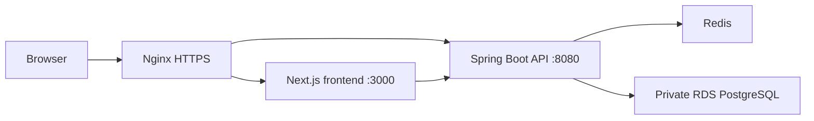

# Architecture

This repository is a full-stack e-commerce demo built as a monorepo.

## Components

- `apps/web`: Next.js frontend.
- `apps/api`: Spring Boot backend.
- PostgreSQL RDS: production database.
- Redis: cache/session support and realtime state.
- Nginx: public reverse proxy and HTTPS termination.
- Docker Compose: runtime orchestration on EC2.

## Request Flow

## Production Boundary

Only Nginx is public. Backend and frontend containers are reached through local host ports or the Docker network. RDS is private and accepts traffic from the EC2 security group only.

## Notable Features

- Google OAuth login.
- JWT access/refresh token flow.
- Product search with PostgreSQL full-text search.
- RAG document search with pgvector and `tsvector`.
- Admin product/user/order flows.
- Chat, notifications, cart, favorites, reviews, and payments.